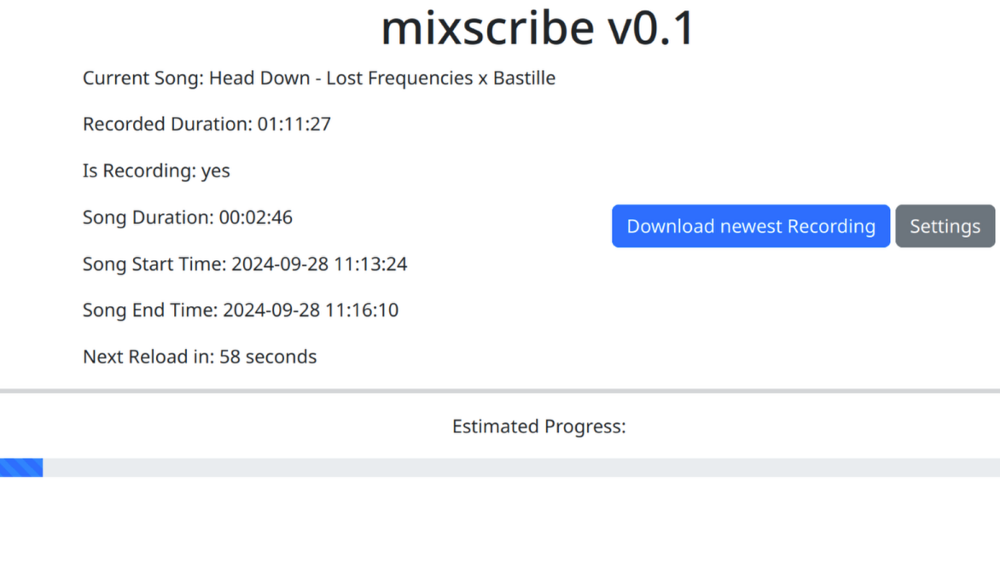
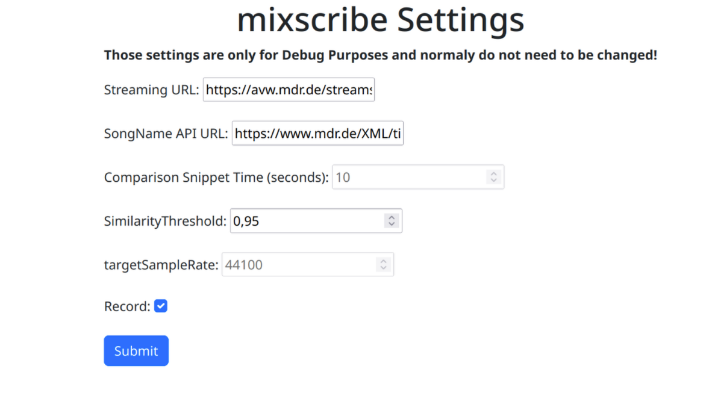

## mixscribe

mixscribe is like a radio recorder and it checks for looping parts. It works by recording and then checking if it starts overlapping with a previous part of the already saved audio. If it does, it then saves the file and waits until a different mix is played.

PS: Please don't sue me, Ard, and yes, I know the code is bad.

# Screenshots

  
  

# Installation

We recommend installing mixscribe on a VPS with some memory to spare (swap should work), good uptime, and a stable internet connection. Theoretically, you can run mixscribe on a home internet connection, but if you have Telekom as your provider, we don't recommend even thinking about it.

TODO: Add installation instructions or create a Docker container.

# Requirements

TODO: Add requirements.

# Developers

Run the program with `go run main.go`

# Current State

The current state of the project is still in development, and the part where it checks if the audio is still the same is very basic and not working well. The project is open-source, and any help is welcome. If you have any ideas or want to help, please don't hesitate to open an issue or make a pull request.

# Licensing

See [COPYING](COPYING)
